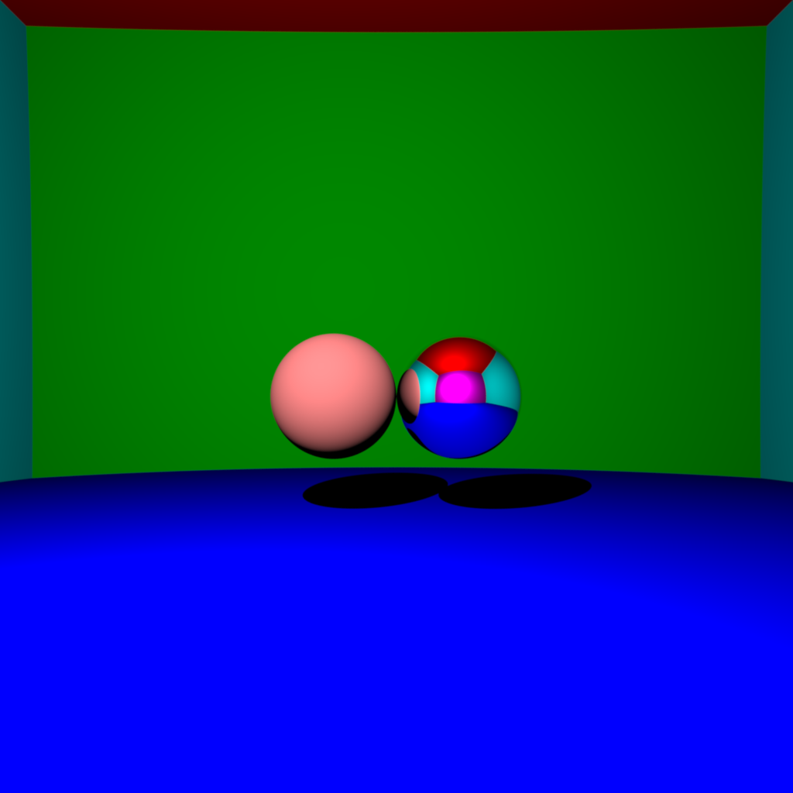
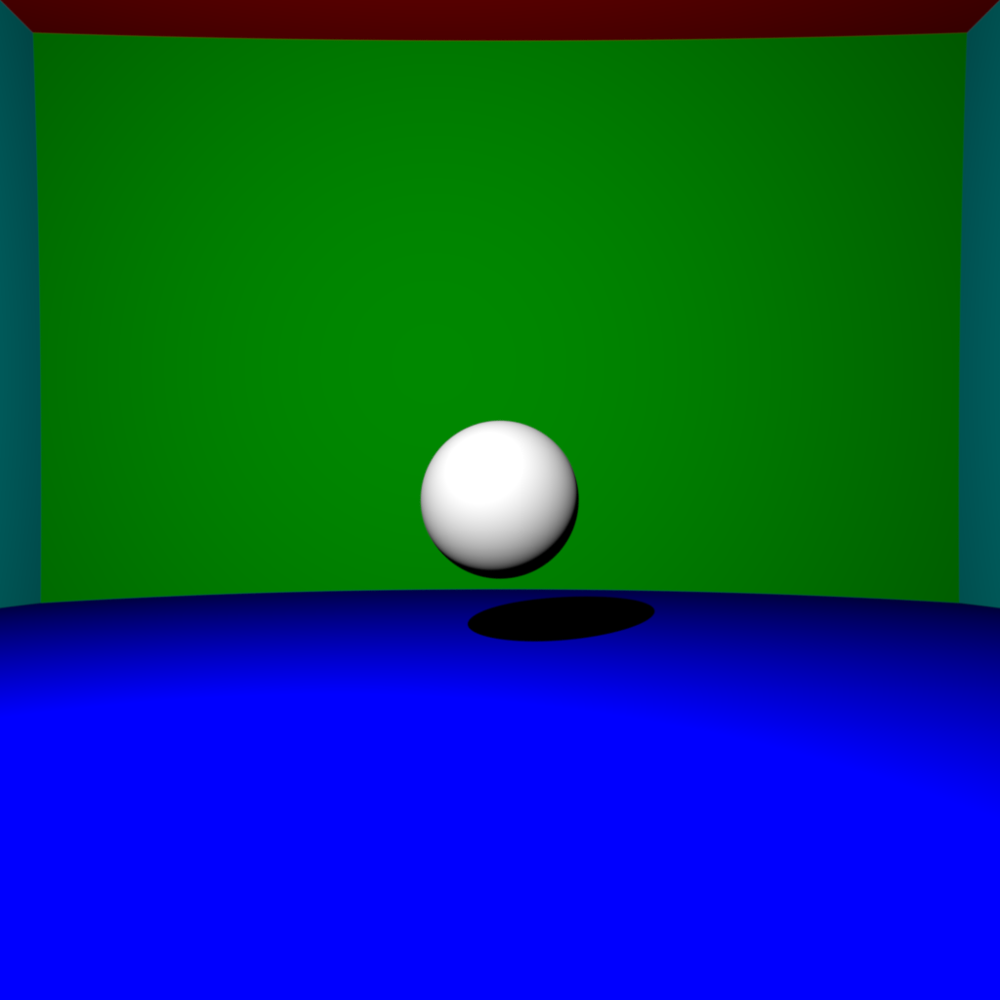
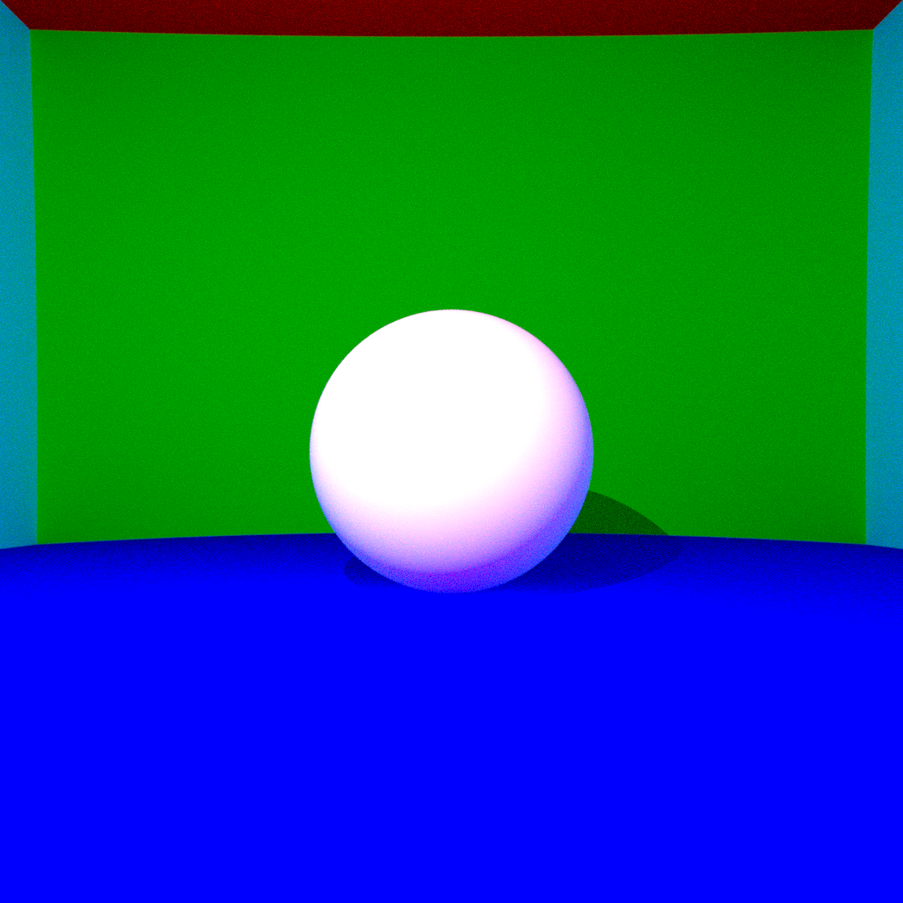
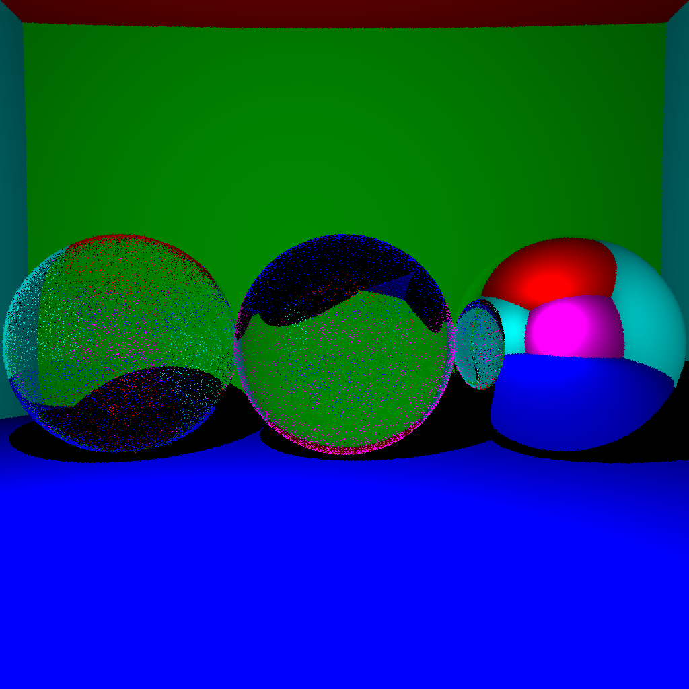
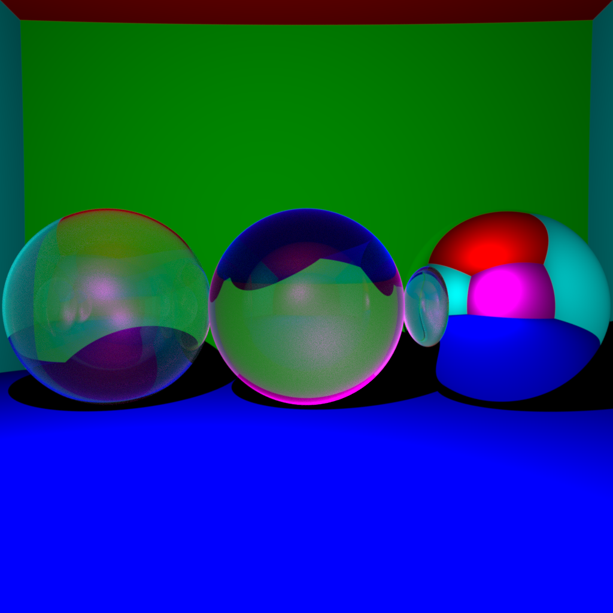
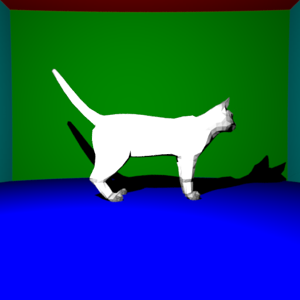
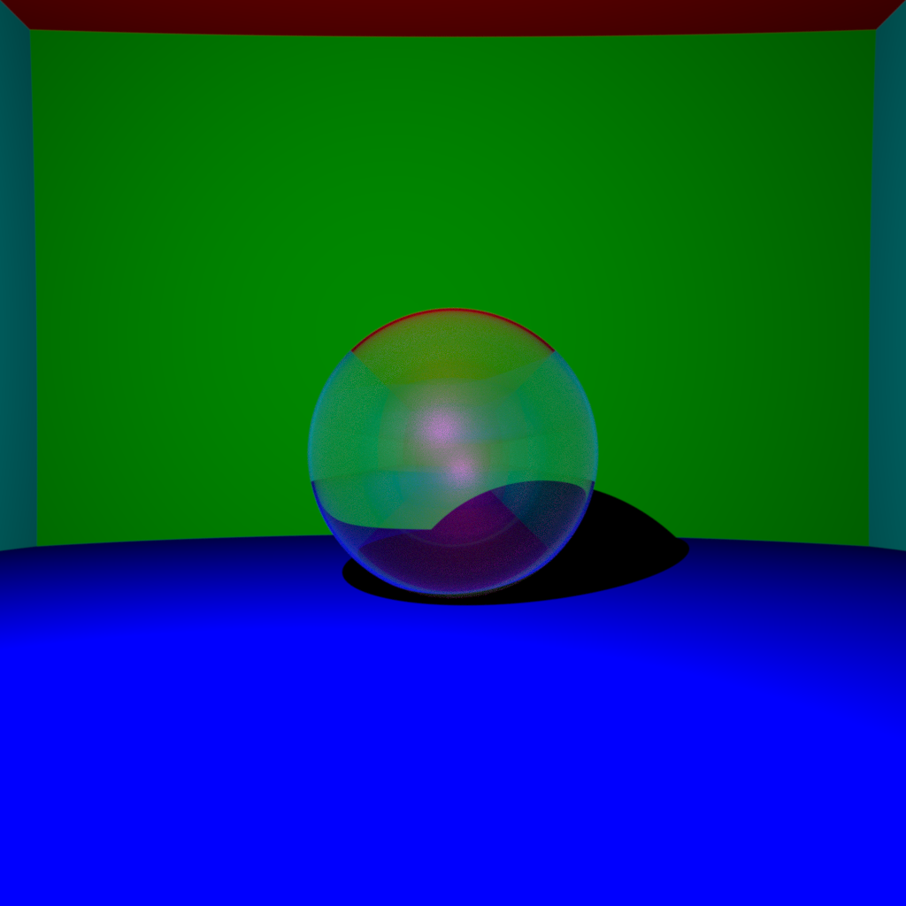

### Introduction

In this assignment, we implemented a raytracer project to render 3D scenes with various features such as diffuse and mirror surfaces, direct lighting and shadows, indirect lighting, antialiasing, and ray-mesh intersection with Bounding Volume Hierarchy (BVH) acceleration. The main objective was to create a realistic and visually appealing rendering of the scene by simulating the interaction of light with different surfaces and materials.

The implemented features include:
1. Diffuse and mirror surfaces
2. Direct lighting and shadows for point light sources
3. Indirect lighting for point light sources (without Russian roulette)
4. Antialiasing
5. Ray-mesh intersection with BVH acceleration

**ALL of the images below except the cat have the following config:**
```cpp
    int imageWidth = 1024;
    int imageHeight = 1024;
    Vector camera = Vector(0, 0, 55);
    double fieldOfView = degToRad(60);
    double gamma = 2.2;
    int maxDepth = 20;
    int raysPerPixel = 600;
```

### Diffuse and Mirror Surfaces

To simulate diffuse and mirror surfaces, we implemented the Phong reflection model. For diffuse surfaces, the incoming light is scattered equally in all directions, resulting in a matte appearance. The diffuse color of the surface is calculated based on the angle between the surface normal and the direction of the incoming light.

For mirror surfaces, the incoming light is reflected in a single direction, creating a specular highlight. The reflected ray direction is calculated using the law of reflection, which states that the angle of incidence equals the angle of reflection.

*This image took 16734ms to render*

The code snippet below shows how the diffuse and mirror surfaces are handled in the `getColor` function:

```cpp
if (intersection.isReflective) {
    Ray reflectedRay = Ray(localPosition, ray.direction - (2 * dot(ray.direction, localNormal) * localNormal));
    return getColor(reflectedRay, depth - 1);
}

// Add direct lighting in diffuse case
double distance = (lightSource - localPosition).norm();
Vector lightDirection = (lightSource - localPosition).normalized();
Intersection lightIntersection = intersect(Ray(lightSource, lightDirection * (-1.)));
double visibility = (!lightIntersection.intersects || lightIntersection.distance > distance) ? 1. : 0.;
color = lightIntensity / (4 * M_PI * distance * distance) * intersection.color / M_PI * visibility * std::max(0., dot(lightDirection, localNormal));
```

In the code above, if the surface is reflective (mirror), a reflected ray is generated and recursively traced to calculate the color. For diffuse surfaces, the direct lighting contribution is calculated based on the light intensity, surface color, and the angle between the light direction and the surface normal.

### Direct Lighting and Shadows

To implement direct lighting and shadows for point light sources, we calculate the visibility of the light source from the intersection point. We shoot a ray from the intersection point towards the light source and check if there are any occluding objects between them. If there are no occluders, the intersection point is illuminated by the light source, and the direct lighting contribution is added to the pixel color.

The direct lighting contribution is calculated using the following formula:

```
color = lightIntensity / (4 * PI * distance^2) * surfaceColor / PI * visibility * max(0, dot(lightDirection, surfaceNormal))
```

Here, `lightIntensity` is the intensity of the point light source, `distance` is the distance between the intersection point and the light source, `surfaceColor` is the color of the surface, `visibility` is either 1 (illuminated) or 0 (shadowed), and `dot(lightDirection, surfaceNormal)` represents the cosine of the angle between the light direction and the surface normal.


*This image took 16635ms to render*

The code snippet below shows how direct lighting and shadows are implemented in the `getColor` function:

```cpp
double distance = (lightSource - localPosition).norm();
Vector lightDirection = (lightSource - localPosition).normalized();
Intersection lightIntersection = intersect(Ray(lightSource, lightDirection * (-1.)));
double visibility = (!lightIntersection.intersects || lightIntersection.distance > distance) ? 1. : 0.;
color = lightIntensity / (4 * M_PI * distance * distance) * intersection.color / M_PI * visibility * std::max(0., dot(lightDirection, localNormal));
```

### Indirect Lighting

Indirect lighting simulates the bouncing of light between surfaces, resulting in a more realistic and globally illuminated scene. In this implementation, indirect lighting is achieved by shooting random rays from the intersection point and recursively tracing them to gather the incoming light from other surfaces.

The indirect lighting contribution is calculated by multiplying the surface color with the color obtained from the recursively traced random ray. This process is repeated for a fixed number of bounces (determined by the `depth` parameter) to capture the multiple bounces of light.

This is a ball *without* indirect lighting:

*This image took 2866ms to render*

And this is **with** indirect lighting:

*This image took 64851ms to render*


The code snippet below shows how indirect lighting is implemented in the `getColor` function:

```cpp
// Indirect lighting
Ray randomRay = Ray(localPosition, randomCosineDirection(localNormal));
color = color + intersection.color * getColor(randomRay, depth - 1);
```

In the code above, a random ray is generated using the `randomCosineDirection` function, which returns a random direction based on the cosine-weighted distribution around the surface normal. The color obtained from tracing the random ray is multiplied with the surface color and added to the pixel color.

### Antialiasing

Antialiasing is a technique used to reduce the appearance of jagged edges (aliasing) in rendered images. In this implementation, antialiasing is achieved through supersampling, where multiple rays are shot per pixel and their colors are averaged to obtain the final pixel color.

The supersampling process is performed by generating random offsets for each ray within the pixel's area. These offsets are generated using the Box-Muller transform, which produces random numbers with a Gaussian distribution.

No antialiasing:

*This image took 61ms to render*

With antialising:

*This image took 27711ms to render*

The code snippet below shows how antialiasing is implemented in the main rendering loop:

```cpp
for (int i = 0; i < raysPerPixel; i++) {
    BoxMuller(0.5, offsetX, offsetY);
    Vector pixel = Vector(camera[0] + (x + offsetX) + 0.5 - imageWidth / 2,
                          camera[1] - (y + offsetY) - 0.5 + imageHeight / 2,
                          camera[2] - imageWidth / (2 * tan(fieldOfView / 2)));
    Ray ray = Ray(camera, (pixel - camera).normalized());
    pixelColor = pixelColor + scene.getColor(ray, maxDepth);
}
pixelColor = pixelColor / raysPerPixel;
```

In the code above, `raysPerPixel` determines the number of rays to be shot per pixel. For each ray, random offsets (`offsetX` and `offsetY`) are generated using the Box-Muller transform. The pixel position is adjusted based on these offsets, and a ray is generated from the camera to the pixel. The colors of all the rays are accumulated and averaged to obtain the final pixel color.

### Ray Mesh Intersection and BVH

To render meshes in the raytracer, we implemented the Möller–Trumbore ray-triangle intersection algorithm. This algorithm efficiently determines whether a ray intersects a triangle by solving a system of linear equations. The algorithm calculates the barycentric coordinates of the intersection point within the triangle and checks if they are within the valid range (between 0 and 1).

The Möller–Trumbore algorithm is implemented in the `intersect` function of the `TriangleMesh` class. The code snippet below shows the key steps of the algorithm:

```cpp
double beta = dot(cross(vertexA - ray.origin, ray.direction), edge2) / dot(ray.direction, normal);
double gamma = -dot(cross(vertexA - ray.origin, ray.direction), edge1) / dot(ray.direction, normal);
double alpha = 1.0 - beta - gamma;
double t = dot(vertexA - ray.origin, normal) / dot(ray.direction, normal);

if (alpha >= 0 && beta >= 0 && gamma >= 0 && t > 0 && t < tMin) {
    tMin = t;
    intersection.intersects = true;
    intersection.distance = t;
    intersection.position = vertexA + beta * edge1 + gamma * edge2;
    intersection.normal = normal;
}
```

To accelerate the rendering process when dealing with large meshes, we implemented a Bounding Volume Hierarchy (BVH). The BVH is a tree-like structure that hierarchically subdivides the mesh into smaller bounding volumes. Each leaf node of the BVH contains a subset of the mesh triangles, while internal nodes represent the bounding volumes of their child nodes.

The BVH is constructed by recursively splitting the mesh triangles based on their spatial distribution. In our implementation, we choose the splitting plane along the longest axis of the bounding box and partition the triangles based on their centroid position relative to the splitting plane.

During the intersection process, the BVH is traversed from the root node. If a ray intersects the bounding volume of a node, its child nodes are recursively checked for intersection. This hierarchical approach allows us to quickly discard large portions of the mesh that are not intersected by the ray, significantly reducing the number of ray-triangle intersection tests.


*This image took 111199ms to render with the following config:*
```cpp
    int imageWidth = 512;
    int imageHeight = 512;
    Vector camera = Vector(0, 0, 55);
    double fieldOfView = degToRad(60);
    double gamma = 2.2;
    int maxDepth = 5;
    int raysPerPixel = 64;
```

The BVH implementation provided a $\sim7\times$ in rendering times compared to testing the ray against every triangle in the mesh.

### Additional Features (Optional)

In addition to the basic features, we implemented the following optional features in our raytracer:

1. Transparent Surfaces:
   We added support for transparent surfaces by implementing refraction based on Snell's law and Fresnel equations. When a ray intersects a transparent surface, it is split into a reflected ray and a refracted ray. The Fresnel equations determine the amount of light that is reflected and refracted at the surface interface. This allows us to render objects with varying degrees of transparency and create realistic glass-like materials.

   
   *This image took 22388ms to render*


### Conclusion

In this assignment, we successfully implemented a raytracer with various features to render 3D scenes with realistic lighting and shading. The key features included diffuse and mirror surfaces, direct lighting and shadows, indirect lighting, antialiasing, and ray-mesh intersection with BVH acceleration.

The implementation of diffuse and mirror surfaces allowed us to simulate different material properties and create visually diverse scenes. Direct lighting and shadows added a sense of depth and realism to the rendered images. Indirect lighting, although computationally expensive, provided a more natural and globally illuminated look to the scenes.

Antialiasing, achieved through supersampling, significantly improved the visual quality of the rendered images by reducing jagged edges and aliasing artifacts. The Möller–Trumbore algorithm enabled efficient ray-triangle intersection tests, while the BVH acceleration structure greatly improved the rendering performance for scenes with complex meshes.

During the implementation process, we encountered challenges such as ensuring the correctness of the intersection calculations, handling numerical precision issues, and optimizing the performance of the raytracer. However, by carefully debugging and optimizing the code, we were able to overcome these challenges and achieve satisfactory results.

In the future, there are several potential improvements and extensions that can be made to the raytracer. These include implementing more advanced shading models, such as physically-based rendering (PBR), adding support for volumetric effects like fog and participating media, and exploring more efficient acceleration structures like the k-d tree or the bounding interval hierarchy (BIH).

Overall, this assignment provided hands-on experience in implementing a raytracer from scratch and understanding the fundamental concepts and algorithms involved in realistic image synthesis. The implemented features contributed to the creation of visually appealing and physically plausible rendered images.